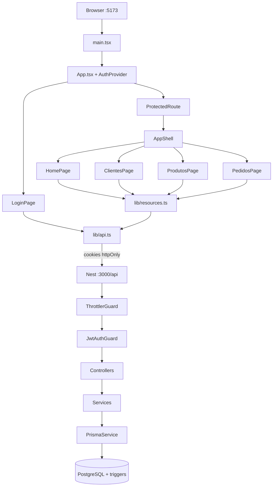

# Fluxo da aplicação — modelo Prottus (Distac)

Documento-**modelo** do caminho de execução: do `npm` até cada tela/CRUD, com **arquivo e responsabilidade** em cada passo.

Use este arquivo em **todo clone** da base:

1. Manter a **estrutura das seções** (Init → Auth → Shell/Home → Módulos).
2. Trocar as tabelas Distac pelos caminhos/rotas do **novo cliente**.
3. Manter o padrão de camadas (não inventar outro fluxo HTTP).

Complementos: [`ARQUITETURA-WEB.md`](ARQUITETURA-WEB.md) · [`seguranca.md`](seguranca.md) · [`DOMINIO-TECNICO.md`](DOMINIO-TECNICO.md) · [`USAR-COMO-BASE.md`](USAR-COMO-BASE.md).

---

## Como usar como modelo em outro projeto

| Passo | Ação |
|-------|------|
| 1 | Copiar este arquivo no novo repo (já vem com o clone). |
| 2 | Renomear título/cliente; manter seções 1–4. |
| 3 | Atualizar tabelas “Onde no código” com módulos/páginas novos. |
| 4 | Atualizar o diagrama mermaid (rotas e módulos). |
| 5 | Linkar no `docs/projeto/README.md` e no README da raiz. |

**O que costuma ficar igual entre clientes**

- Boot FE (`main.tsx` → `App` → `AuthProvider`) e boot BE (`main.ts` → `AppModule` → guards).
- Cliente HTTP com `credentials: 'include'` + refresh em 401.
- Auth JWT em cookie httpOnly + `@Public()` em login/refresh/logout/health.
- Padrão Page → `resources.ts` → Controller → Service → Prisma.

**O que costuma mudar**

- Nomes de páginas, módulos Nest, entidades e rotas de negócio.
- Regras de soft-delete / triggers específicas do domínio.

---

## Visão geral (camadas)

```
Browser (Vite :5173)
  → React pages / AuthContext
  → lib/api.ts (cookies) + lib/resources.ts
  → Nest API (:3000/api)
      Helmet → cookie-parser → CORS → ThrottlerGuard → JwtAuthGuard → ValidationPipe
      → Controller → Service → Prisma → PostgreSQL (+ triggers)
```



---

## 1. Inicialização NPM

### Modelo (qualquer projeto desta base)

| Ordem | Comando / entrada | Efeito |
|-------|-------------------|--------|
| A | `npm run install:all` (raiz) | Instala `backend/` e `frontend/` |
| B | `npm run setup` | Postgres local + migrate + check |
| C | `npm run dev:api` | Nest em watch → `bootstrap()` |
| D | `npm run dev:web` | Vite → `index.html` → `main.tsx` |

### Distac — onde no código

| Camada | Arquivo | O que acontece |
|--------|---------|----------------|
| Orquestração | [`package.json`](../../package.json) | `install:all`, `setup`, `dev:api`, `dev:web` |
| FE entry | [`frontend/index.html`](../../frontend/index.html) | Carrega `/src/main.tsx` |
| FE mount | [`frontend/src/main.tsx`](../../frontend/src/main.tsx) | `createRoot` → `<App />` |
| FE rotas | [`frontend/src/App.tsx`](../../frontend/src/App.tsx) | `AuthProvider` + rotas públicas/protegidas |
| BE script | [`backend/package.json`](../../backend/package.json) | `"dev": "nest start --watch"` |
| BE boot | [`backend/src/main.ts`](../../backend/src/main.ts) | Helmet, cookies, CORS+credentials, ValidationPipe, prefixo `api`, Swagger, `listen` |
| BE módulos | [`backend/src/app.module.ts`](../../backend/src/app.module.ts) | Config, Throttler, Prisma, domínio; `APP_GUARD` Throttler + Jwt |
| DB | [`backend/src/prisma/prisma.service.ts`](../../backend/src/prisma/prisma.service.ts) | Conecta no boot |
| Seed opcional | [`backend/src/auth/auth.service.ts`](../../backend/src/auth/auth.service.ts) | `onModuleInit` se `SEED_DEMO_USER_ON_BOOT=true` |

**Ordem de middleware/guards na API (modelo):** Helmet → cookie-parser → CORS → ThrottlerGuard → JwtAuthGuard → ValidationPipe → rota.

---

## 2. Login e comunicação FE ↔ BE

### Modelo — sequência obrigatória

```
LoginPage
  → AuthContext.login
  → loginRequest (api.ts)
  → POST /api/auth/login  (@Public + throttle estrito)
  → AuthService (bcrypt + JWT access/refresh)
  → setAuthCookies (httpOnly)
  → body { user }  (token NÃO vai no JSON)
  → setUser → ProtectedRoute → AppShell
```

Chamadas autenticadas depois:

```
Page → resources.ts → apiFetch (credentials: include)
  → cookie access_token
  → JwtStrategy (extrai cookie) → req.user
  → Controller → Service → Prisma
```

Em **401**: `apiFetch` tenta `POST /auth/refresh` e **repete** a request uma vez.

### Distac — onde no código

| Passo | Arquivo | Detalhe |
|-------|---------|---------|
| UI | [`frontend/src/pages/LoginPage.tsx`](../../frontend/src/pages/LoginPage.tsx) | Submit → `login(email, password)` |
| Sessão | [`frontend/src/auth/AuthContext.tsx`](../../frontend/src/auth/AuthContext.tsx) | Boot: `meRequest()`; login/logout; estado `user` |
| Guard de rota | [`frontend/src/auth/ProtectedRoute.tsx`](../../frontend/src/auth/ProtectedRoute.tsx) | Sem `user` → redireciona login |
| HTTP | [`frontend/src/lib/api.ts`](../../frontend/src/lib/api.ts) | Base URL, `credentials: 'include'`, refresh em 401, `loginRequest` / `meRequest` |
| Controller | [`backend/src/auth/auth.controller.ts`](../../backend/src/auth/auth.controller.ts) | `login` / `refresh` / `logout` (`@Public`) + `me`; cookies |
| Service | [`backend/src/auth/auth.service.ts`](../../backend/src/auth/auth.service.ts) | Validação bcrypt, assinatura JWT |
| Strategy | [`backend/src/auth/jwt.strategy.ts`](../../backend/src/auth/jwt.strategy.ts) | Lê cookie `access_token` |
| Guard | [`backend/src/auth/jwt-auth.guard.ts`](../../backend/src/auth/jwt-auth.guard.ts) | Global; respeita `@Public()` |
| Segurança | [`docs/projeto/seguranca.md`](seguranca.md) | Contrato completo |

### Endpoints de sessão (Distac)

| Método | Rota | Público | Throttle | Função |
|--------|------|---------|----------|--------|
| POST | `/api/auth/login` | sim | 10/min | Login + set cookies |
| POST | `/api/auth/refresh` | sim | 20/min | Renova access via refresh cookie |
| POST | `/api/auth/logout` | sim | global | Limpa cookies |
| GET | `/api/auth/me` | **não** | global | Perfil da sessão |
| GET | `/api/health` | sim | skip | Health check |

---

## 3. Home / Shell

### Modelo

Após auth: layout (`AppShell`) + rota índice que consome um endpoint leve de **summary** (não listar entidades pesadas na home).

### Distac — onde no código

| Peça | Arquivo | HTTP |
|------|---------|------|
| Rotas | [`frontend/src/App.tsx`](../../frontend/src/App.tsx) | `/` → Home dentro de `ProtectedRoute` |
| Layout | [`frontend/src/components/AppShell.tsx`](../../frontend/src/components/AppShell.tsx) | Nav + outlet |
| Página | [`frontend/src/pages/HomePage.tsx`](../../frontend/src/pages/HomePage.tsx) | `dashboardApi.summary()` no mount |
| Facade | [`frontend/src/lib/resources.ts`](../../frontend/src/lib/resources.ts) | `dashboardApi` |
| API | [`backend/src/dashboard/dashboard.controller.ts`](../../backend/src/dashboard/dashboard.controller.ts) | `GET /api/dashboard/summary` |
| Regra | [`backend/src/dashboard/dashboard.service.ts`](../../backend/src/dashboard/dashboard.service.ts) | Contagens + pedidos recentes |

---

## 4. Módulos e CRUD (padrão)

### Modelo de um módulo de negócio

```
{Entidade}Page.tsx
  → {entidade}Api em lib/resources.ts
  → apiFetch
  → {Entidade}Controller
  → {Entidade}Service
  → Prisma
  → (opcional) triggers SQL / audit_log
```

**CRUD canônico (modelo)**

| Ação UI | HTTP típico | Backend |
|---------|-------------|---------|
| Listar (paginado + busca) | `GET /api/{recurso}?page&q` | `list` |
| Options (selects) | `GET /api/{recurso}/options/all` | `listOptions` — lista curta |
| Detalhe | `GET /api/{recurso}/:id` | `findOne` |
| Criar | `POST /api/{recurso}` | `create` + DTO |
| Editar | `PATCH /api/{recurso}/:id` | `update` |
| Excluir | `DELETE /api/{recurso}/:id` | hard delete **ou** soft (`ativo=false`) se houver FK |

Ao clonar: copie um módulo Distac (ex. `clientes`) e renomeie — mantenha Controller/Service/DTO/Page/resources.

### 4.1 Clientes (Distac)

| Ação | Frontend | HTTP | Backend |
|------|----------|------|---------|
| Listar | `ClientesPage` → `clientesApi.list` | `GET /api/clientes` | `ClientesService.list` |
| Options | `clientesApi.options` | `GET /api/clientes/options/all` | `listOptions` |
| Criar | `clientesApi.create` | `POST /api/clientes` | `create` (CNPJ dup → 409) |
| Editar | `clientesApi.update` | `PATCH /api/clientes/:id` | `update` |
| Excluir | `clientesApi.remove` | `DELETE /api/clientes/:id` | soft se tem pedidos; senão DELETE |

- FE: [`frontend/src/pages/ClientesPage.tsx`](../../frontend/src/pages/ClientesPage.tsx)
- BE: [`backend/src/clientes/`](../../backend/src/clientes/)

### 4.2 Produtos (Distac)

| Ação | HTTP | Regra de negócio |
|------|------|------------------|
| List | `GET /api/produtos` | Paginado |
| Options | `GET /api/produtos/options/all` | Inclui preço (pedido) |
| Create | `POST /api/produtos` | Código único → 409 |
| Update | `PATCH /api/produtos/:id` | — |
| Delete | `DELETE /api/produtos/:id` | Soft se já tem `pedido_item` |

- FE: [`frontend/src/pages/ProdutosPage.tsx`](../../frontend/src/pages/ProdutosPage.tsx)
- BE: [`backend/src/produtos/`](../../backend/src/produtos/)

### 4.3 Pedidos (Distac — fluxo mais denso)

| Ação | HTTP | Fluxo |
|------|------|--------|
| List | `GET /api/pedidos` | Cliente + itens |
| Create | `POST /api/pedidos` | Cliente ativo → itens → **não** grava `total` na API → trigger recalcula → service **relê** |
| Update | `PATCH /api/pedidos/:id` | Bloqueia se cancelado; itens = replace; `total` só no banco |
| Delete | `DELETE /api/pedidos/:id` | Hard delete |

- FE: [`frontend/src/pages/PedidosPage.tsx`](../../frontend/src/pages/PedidosPage.tsx) (+ options de clientes/produtos)
- BE: [`backend/src/pedidos/`](../../backend/src/pedidos/)
- Triggers: [`database/sql/03-triggers.sql`](../../database/sql/03-triggers.sql) · [`database/info/triggers.md`](../../database/info/triggers.md)

---

## 5. Checklist ao documentar um novo cliente

Copie e preencha no clone:

- [ ] Seção 1: scripts de boot ainda batem com `package.json`
- [ ] Seção 2: rotas de auth e arquivos de cookie/JWT atualizados (se mudaram nomes)
- [ ] Seção 3: home/summary do novo domínio
- [ ] Seção 4: uma subseção por módulo de negócio (tabela CRUD + paths)
- [ ] Diagrama mermaid com rotas reais
- [ ] Links no `docs/projeto/README.md` e README da raiz
- [ ] Nada de secrets/senhas reais neste doc (só paths e contratos)

---

## Referência rápida de pastas (Distac / base)

| O quê | Onde |
|-------|------|
| Boot FE | `frontend/src/main.tsx`, `App.tsx` |
| HTTP + refresh | `frontend/src/lib/api.ts` |
| Facades tipadas | `frontend/src/lib/resources.ts` |
| Sessão | `frontend/src/auth/AuthContext.tsx` |
| Boot BE | `backend/src/main.ts`, `app.module.ts` |
| Auth | `backend/src/auth/` |
| Telas | `frontend/src/pages/` |
| Módulos Nest | `backend/src/{clientes,produtos,pedidos,dashboard}/` |
| Integridade SQL | `database/sql/` |
