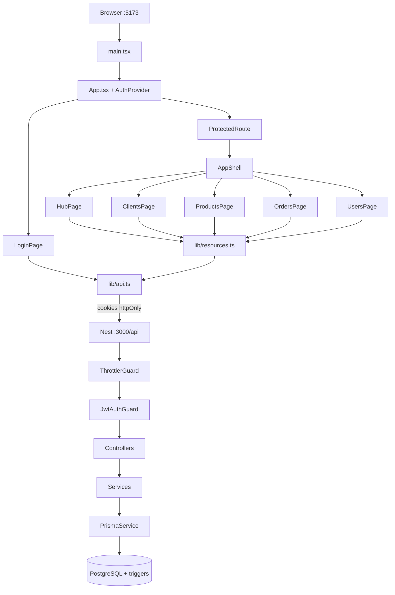

# Fluxo da aplicação — modelo Prottus (Distac)

Documento-**modelo** do caminho de execução: do `npm` até cada tela/CRUD, com **arquivo e responsabilidade** em cada passo.

Use este arquivo em **todo clone** da base:

1. Manter a **estrutura das seções** (Init → Auth → Shell/Home → Módulos).
2. Trocar as tabelas Distac pelos caminhos/rotas do **novo cliente**.
3. Manter o padrão de camadas (não inventar outro fluxo HTTP).

Complementos: [`ARQUITETURA-WEB.md`](ARQUITETURA-WEB.md) · [`seguranca.md`](seguranca.md) · [`DOMINIO-TECNICO.md`](DOMINIO-TECNICO.md) · [`USAR-COMO-BASE.md`](USAR-COMO-BASE.md) · [`COMO-INICIAR-UM-NOVO-PROJETO.md`](../../COMO-INICIAR-UM-NOVO-PROJETO.md).

---

## Como usar como modelo em outro projeto

| Passo | Ação |
|-------|------|
| 1 | Copiar este arquivo no novo repo (já vem com o clone). |
| 2 | Renomear título/cliente; manter seções 1–4. |
| 3 | Atualizar tabelas “Onde no código” com módulos/páginas novos. |
| 4 | Atualizar o diagrama mermaid (rotas e módulos). |
| 5 | Linkar no `docs/projeto/README.md` e no README da raiz. |

**O que costuma ficar igual**

- Boot FE (`main.tsx` → `App` → `AuthProvider`) e boot BE (`main.ts` → `AppModule` → guards).
- Cliente HTTP com `credentials: 'include'` + refresh em 401.
- Auth JWT em cookie httpOnly + `@Public()` + JwtStrategy com usuário ativo.
- Padrão Page → `resources.ts` → Controller → Service → Prisma (+ triggers).

**O que costuma mudar**

- Nomes de páginas, módulos Nest, entidades e rotas de negócio.
- Regras de soft-delete / triggers específicas do domínio.

---

## Visão geral (camadas)

```
Browser (Vite :5173)
  → React pages / AuthContext
  → lib/api.ts (cookies) + lib/resources.ts
  → Nest API (:3000/api)
      Helmet → cookie-parser → CORS → ThrottlerGuard → JwtAuthGuard → ValidationPipe
      → Controller → Service → Prisma → PostgreSQL (+ triggers)
```



---

## 1. Inicialização NPM

| Ordem | Comando | Efeito |
|-------|---------|--------|
| A | `npm run install:all` | Instala `backend/` e `frontend/` |
| B | `npm run setup` | Postgres + migrate + seed + check |
| C | `npm run dev:api` | Nest watch → `bootstrap()` |
| D | `npm run dev:web` | Vite → `index.html` → `main.tsx` |

| Camada | Arquivo |
|--------|---------|
| Orquestração | `package.json` (raiz) |
| FE mount | `frontend/src/main.tsx` · `App.tsx` |
| BE boot | `backend/src/main.ts` · `app.module.ts` |
| DB | `backend/src/prisma/prisma.service.ts` |
| Seed | `backend/prisma/seed.ts` |

**Middleware/guards:** Helmet → cookie-parser → CORS → ThrottlerGuard → JwtAuthGuard → ValidationPipe → rota.

---

## 2. Login e comunicação FE ↔ BE

```
LoginPage → AuthContext.login → loginRequest → POST /api/auth/login
  → @Public + throttle → AuthService (bcrypt + JWT)
  → setAuthCookies (httpOnly) → body { user }
  → JwtStrategy (cookie + user ativo) em chamadas seguintes
```

| Passo | Arquivo |
|-------|---------|
| UI | `frontend/src/pages/LoginPage.tsx` |
| Sessão | `frontend/src/auth/AuthContext.tsx` |
| HTTP | `frontend/src/lib/api.ts` |
| Cookies / login | `backend/src/auth/auth.controller.ts` |
| Strategy | `backend/src/auth/jwt.strategy.ts` |
| Guard global | `backend/src/auth/jwt-auth.guard.ts` |

| Método | Rota | Público |
|--------|------|---------|
| POST | `/api/auth/login` | sim (10/min) |
| POST | `/api/auth/refresh` | sim (20/min) |
| POST | `/api/auth/logout` | sim |
| GET | `/api/auth/me` | não |
| GET | `/api/health` | sim |

---

## 3. Hub / Shell

| Peça | Arquivo | HTTP |
|------|---------|------|
| Rotas | `frontend/src/App.tsx` | `/` Hub; UI `/clientes`… API `/clients`… |
| Layout | `frontend/src/components/AppShell.tsx` | Nav + Usuários |
| Página | `frontend/src/pages/HubPage.tsx` | `GET /api/dashboard/summary` |
| API | `backend/src/dashboard/` | counts EN + pedidos recentes |

---

## 4. Módulos CRUD (padrão)

```
{Page}.tsx → {resource}Api (lib/resources.ts) → apiFetch
  → Controller → Service → Prisma → triggers
```

| UI (PT) | API (EN) | Backend |
|---------|----------|---------|
| `/clientes` | `/api/clients` | `backend/src/clients/` |
| `/produtos` | `/api/products` | `backend/src/products/` |
| `/pedidos` | `/api/orders` | `backend/src/orders/` |
| `/usuarios` | `/api/users` | `backend/src/users/` |

**Pedidos:** API não é dona de `total` — cria itens → triggers recalculam `line_total`/`total` → service relê.

---

## 5. Checklist ao documentar um novo cliente

- [ ] Seção 1: scripts de boot batem com `package.json`
- [ ] Seção 2: auth/cookies/JWT atualizados
- [ ] Seção 3: hub/summary do domínio
- [ ] Seção 4: uma subseção por módulo (CRUD + paths)
- [ ] Diagrama mermaid com rotas reais
- [ ] Domínio código em inglês; UI em português
- [ ] Nada de secrets neste doc

---

## Referência rápida

| O quê | Onde |
|-------|------|
| Boot FE | `frontend/src/main.tsx`, `App.tsx` |
| HTTP + refresh | `frontend/src/lib/api.ts` |
| Facades | `frontend/src/lib/resources.ts` |
| Boot BE | `backend/src/main.ts`, `app.module.ts` |
| Auth | `backend/src/auth/` |
| Módulos | `backend/src/{users,clients,products,orders,dashboard}/` |
| Integridade SQL | `database/sql/` · migration init |
