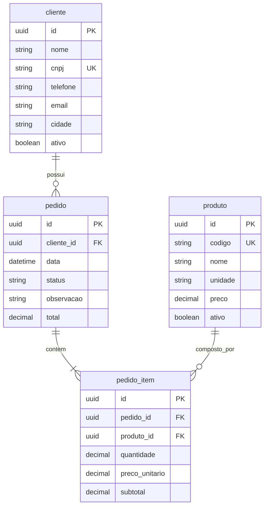

# Mapa de entidades — Distac

Documento vivo do domínio deste cliente.  
Abordagem Prottus: [`docs/prottus/mapa-entidades.md`](../prottus/mapa-entidades.md).

**Tabelas de negócio (fechadas):** `cliente`, `produto`, `pedido`, `pedido_item`.  
**Auth:** `user` (plataforma).  
**Auditoria:** `audit_log` (triggers) — `password_hash` **omitido** nos JSON.  
Detalhes: [`database/info/triggers.md`](../../database/info/triggers.md) · [`seguranca.md`](seguranca.md).

Este mapa é o domínio Distac **e** o exemplo de como documentar entidades na base Prottus.

---

## 1. Visão do domínio

A Distac vende material de construção para lojas (clientes B2B) em Pernambuco. O vendedor interno autentica-se (JWT), mantém **clientes** e **produtos**, e registra **pedidos** com **itens**. Totais do pedido derivam da soma dos subtotais dos itens.

## 2. Áreas previstas

| Área | Responsabilidade | Exemplos de tabelas |
|------|------------------|---------------------|
| `auth` | Login JWT httpOnly | `user` |
| `cadastros` | Clientes e produtos | `cliente`, `produto` |
| `vendas` | Pedidos e itens | `pedido`, `pedido_item` |
| `plataforma` | Auditoria DML | `audit_log` |

## 3. Entidades principais e campos

### `cliente`

| Campo | Tipo lógico | Obrigatório | Notas |
|-------|-------------|-------------|--------|
| `id` | UUID / serial | sim | PK |
| `nome` | texto | sim | Razão social / nome fantasia |
| `cnpj` | texto | sim | Único |
| `telefone` | texto | não | |
| `email` | texto | não | |
| `cidade` | texto | sim | PE / praça |
| `ativo` | boolean | sim | Default `true` |

### `produto`

| Campo | Tipo lógico | Obrigatório | Notas |
|-------|-------------|-------------|--------|
| `id` | UUID / serial | sim | PK |
| `codigo` | texto | sim | Único (SKU interno) |
| `nome` | texto | sim | |
| `unidade` | texto | sim | Ex.: UN, CX, M, KG |
| `preco` | decimal | sim | Preço de referência |
| `ativo` | boolean | sim | Default `true` |

### `pedido`

| Campo | Tipo lógico | Obrigatório | Notas |
|-------|-------------|-------------|--------|
| `id` | UUID / serial | sim | PK |
| `cliente_id` | FK → `cliente` | sim | |
| `data` | data/hora | sim | Default now |
| `status` | enum | sim | Ver abaixo |
| `observacao` | texto | não | |
| `total` | decimal | sim | Soma dos `subtotal` dos itens — **fonte da verdade = trigger** `fn_pedido_recalc_total`; a API Nest **não grava** este campo |

**Status do pedido:** `rascunho` · `confirmado` · `cancelado`

### `pedido_item`

| Campo | Tipo lógico | Obrigatório | Notas |
|-------|-------------|-------------|--------|
| `id` | UUID / serial | sim | PK |
| `pedido_id` | FK → `pedido` | sim | |
| `produto_id` | FK → `produto` | sim | |
| `quantidade` | decimal/num | sim | > 0 |
| `preco_unitario` | decimal | sim | Snapshot do preço na venda |
| `subtotal` | decimal | sim | `quantidade * preco_unitario` |

### Correlações

- `cliente` 1 — N `pedido`
- `pedido` 1 — N `pedido_item`
- `produto` 1 — N `pedido_item`
- Exclusão de `cliente`/`produto` com vínculos: bloquear ou soft-delete via `ativo` (preferir `ativo = false`)

## 4. Diagrama

## 5. Fluxos operacionais

1. Login (JWT cookies) → menu.
2. CRUD cliente / produto (`ativo` para desativar sem quebrar histórico).
3. Criar pedido (`rascunho`) + itens → **triggers** recalculam `subtotal`/`total` e gravam `audit_log` → `confirmado` (ou `cancelado`).
4. Consultar pedidos por cliente, status e período.

## 6. Cardinalidades

- Um `cliente` → zero ou muitos `pedido`
- Um `pedido` → um `cliente`; um ou muitos `pedido_item`
- Um `pedido_item` → um `pedido` e um `produto`

## 7. Decisões em aberto

1. UUID vs serial nas PKs (sugerido: UUID no scaffold).
2. Se `preco_unitario` defaulta do `produto.preco` na inclusão do item (hipótese: sim).

## 8. Alinhamento com telas / aplicações

| Tela / app | Entidades |
|------------|-----------|
| `/login` | auth |
| `menu_main` | navegação |
| `grid_cliente` / `frm_cliente` | `cliente` |
| `grid_produto` / `frm_produto` | `produto` |
| `grid_pedido` / `frm_pedido` | `pedido`, `pedido_item`, `cliente`, `produto` |
