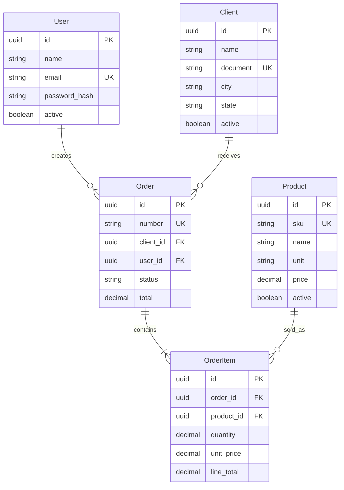

# Mapa de entidades — Distac

Documento vivo do domínio deste cliente.  
Abordagem Prottus: [`docs/prottus/mapa-entidades.md`](../prottus/mapa-entidades.md).

**Tabelas de negócio:** `clients`, `products`, `orders`, `order_items`.  
**Auth:** `users`.  
**Auditoria:** `audit_log` (triggers) — `password_hash` **omitido** nos JSON.  
Código/DB em **inglês**; labels de UI em **português**.  
Detalhes: [`database/info/triggers.md`](../../database/info/triggers.md) · [`seguranca.md`](seguranca.md).

---

## 1. Visão do domínio

A Distac vende material de construção para lojas (clientes B2B) em Pernambuco. O vendedor interno autentica-se (JWT), mantém **clientes** e **produtos**, e registra **pedidos** com **itens**. `orders.total` e `order_items.line_total` são calculados por **triggers** no PostgreSQL.

## 2. Áreas

| Área | Responsabilidade | Tabelas |
|------|------------------|---------|
| `auth` | Login JWT httpOnly + CRUD usuários | `users` |
| `cadastros` | Clientes e produtos | `clients`, `products` |
| `vendas` | Pedidos e itens | `orders`, `order_items` |
| `plataforma` | Auditoria DML | `audit_log` |

## 3. Entidades

| Entidade | Papel |
|----------|--------|
| User | Vendedor/admin que autentica e registra pedidos |
| Client | Loja de materiais |
| Product | Item de catálogo (SKU, unidade, preço) |
| Order | Cabeçalho da venda (`number`, `clientId`, `userId`, status, total) |
| OrderItem | Linha (produto, qtd, preços) |
| AuditLog | Somente triggers |

## 4. Diagrama

## 5. Status de pedido

`DRAFT` | `CONFIRMED` | `CANCELLED` (UI: Rascunho / Confirmado / Cancelado).

## 6. Telas

| Tela UI | API | Entidades |
|---------|-----|-----------|
| `/login` | `/api/auth/*` | User |
| `/` | `/api/dashboard/summary` | agregados |
| `/usuarios` | `/api/users` | User |
| `/clientes` | `/api/clients` | Client |
| `/produtos` | `/api/products` | Product |
| `/pedidos` | `/api/orders` | Order, OrderItem, Client, Product, User |
